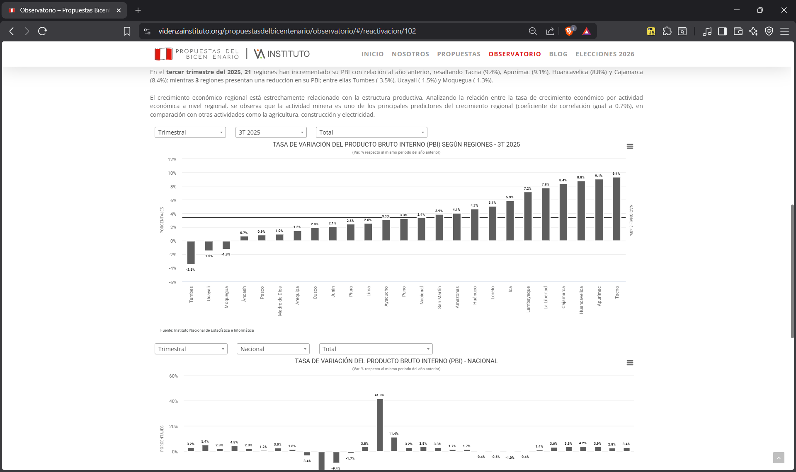
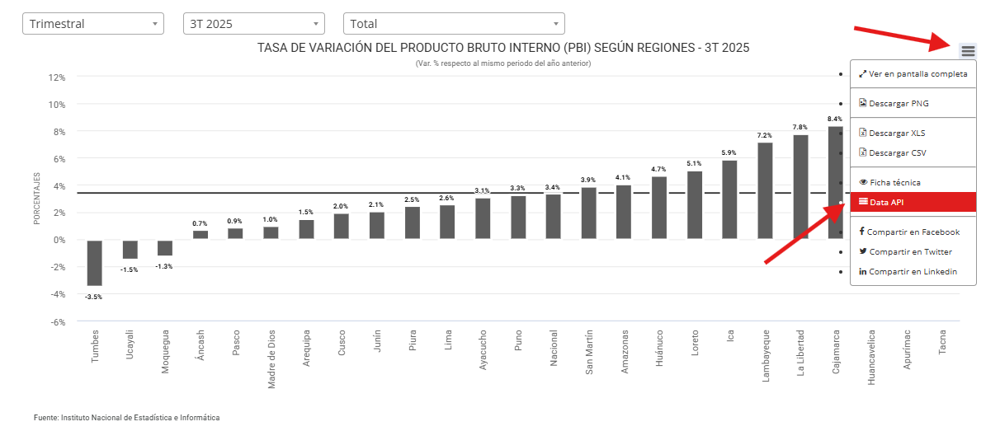
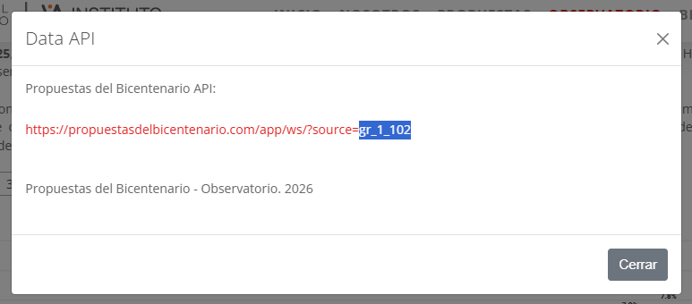

# Manual: cómo acceder a los códigos para usar la API del Observatorio

## Obtener los códigos de las series estadísticas del Observatorio

1. Ingresa a https://videnzainstituto.org/propuestasdelbicentenario/observatorio/.
2. Entra al eje que contiene la información que te interesa:
   - Reactivación económica
   - Estado eficiente y lucha contra la corrupción
   - Reforma política
   - Desarrollo humano: Pobreza, Salud y Educación
   - Actividades extractivas
   - Agricultura
   - Seguridad Ciudadana
3. Ubícate en el gráfico de interés. Por ejemplo: "Tasa de variación de Producto Bruto Interno (PBI) según regiones".

4. Haz clic en las tres barras en la esquina superior derecha del gráfico y luego en "Data API".

5. Copia solo el código de la URL (resaltado en azul). No necesitas copiar toda la URL, basta con el código.

## Códigos de ejemplo

- **gr_1_102**: Tasa de variación de Producto Bruto Interno (PBI) según regiones
- **ge_1_101**: Ejecución presupuestal de la Inversión Pública según región
- **grp_1_108**: Tiempo de aprobación de Proyectos de Ley presentados por el Ejecutivo
- **gp_2_111**: Porcentaje de la población bajo la línea de pobreza total
- **g_1_403**: Porcentaje de niños y niñas de 6 a 35 meses de edad con anemia
- **ged_1_200**: Logros de aprendizaje en educación básica
- **gx_1_106**: Cartera de proyectos mineros
- **ga_1_201**: PEA ocupada en el sector agricultura
- **gi_1_108**: Denuncias cada 10 mil habitantes de principales hechos delictivos
